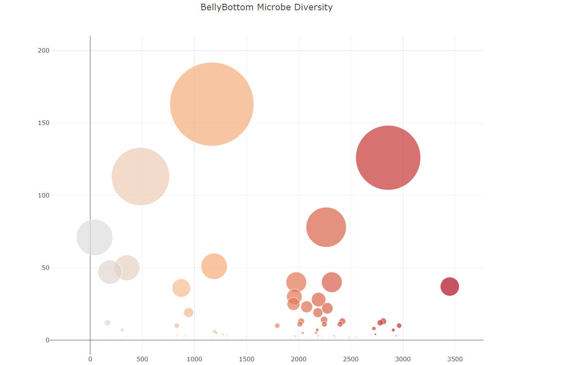

# Plotly_challenge
Project Description

The task is to build an interactive dashboard using Belly Button Diversity data to visualize 
the microbial content of individual’s navel area. The microbes are identified as OTUs (operational 
taxonomic units). The dashboard includes a histogram, gauge chart, and a bubble chart. A dropdown 
is added and each chart changes with each selection.

Tools Required

JavaScript, 
HTML, 
CSS, 
Plotly.js, 
Belly Button Diversity data

Instructions

  Create a horizontal bar chart with a dropdown menu to display the top 10 OTUs found in that individual. 
  Use sample_values as the values for the bar chart.
  Use otu_ids as the labels for the bar chart.
  Use otu_labels as the hover text for the chart.
  Create a bubble chart that displays each sample.
  Use otu_ids for the x values.
  Use sample_values for the y values. 
  Use sample_values for the marker size. 
  Use otu_ids for the marker colors. 
  Use otu_labels for the text values.
  Display the sample metadata.
  Display each key-value pair from the metadata JSON object somewhere on the page. 
  Update all the plots any time that a new sample is selected.
  Update charts whenever a new sample is selected.

Files

app.js – contains the code to create the Belly Button Diversity dashboard
styles.css – contains styles for HTML
index.html – contains code to display webpage and app.js

Results

